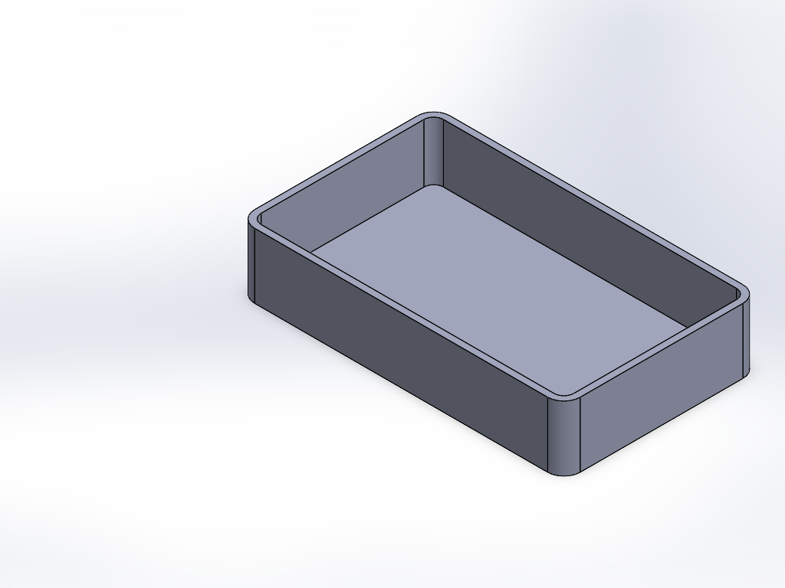

# CAD Copilot

Describe a part in plain English and Claude builds it in SolidWorks, step by step, then looks at the result to check it.

> "A 100×60×20 mm tray with 2 mm walls, open at the top, with 5 mm rounded corners"



## Download and use

1. Download **CADCopilot.exe** from the [Releases page](../../releases/latest) and double-click it.
   Windows may show "Windows protected your PC" because the app isn't code-signed yet. Click **More info → Run anyway**.
2. The first time, paste an **Anthropic API key**. Create one at [console.anthropic.com](https://console.anthropic.com/settings/keys) and add some credit. The key is stored in Windows Credential Manager, and you pay Anthropic directly for what you use. The top bar shows what the current chat has cost.
3. Type what you want to build, or click one of the examples.

**Requirements:** Windows 10 or 11. SolidWorks (tested with 2025) for building real parts; without it, **Demo** mode shows every step Claude plans without building anything.

Parts you ask to save go to `Documents\CAD Copilot Parts`.

### Things to try

- "An 80×50×6 mm plate with four 5 mm holes, 8 mm in from each edge"
- "A 20 mm diameter shaft, 80 mm long, with a 1 mm chamfer on both ends"
- "A 60 mm disc, 8 mm thick, with six 5 mm holes on a 45 mm bolt circle"
- "Now add 1 mm fillets to the top edges" (follow-ups edit the same part)
- "Save it as bracket.STEP"

## How it works

```
 you ──> app window (ui/index.html, pywebview)
             │
             v
          agent.py ──── tools ────> Claude API
             │  <─── tool calls ──────┘
             v
        sw_bridge.py ── COM (pywin32) ──> SolidWorks
```

- **agent.py**: the tool definitions, system prompt and agent loop. Claude picks a tool, the loop runs it and sends back the result, and it repeats until the part is done. It also enforces cost limits: prompt caching, only the newest screenshot is resent, and a maximum of 30 steps per request.
- **Tools**: new part, sketch (rectangles, circles, lines, centerlines), extrude, cut, revolve, fillet, chamfer, shell, model info (feature tree, bounding box, volume), screenshot, undo, save/export.
- **sw_bridge.py**: turns each tool into SolidWorks API calls. Edges and faces are found from the actual geometry, so hidden ones can be picked too. Errors go back to Claude as text so it can correct itself. `MockBridge` is the Demo-mode stand-in.
- **app.py**: the desktop app. Runs the agent on one background thread (SolidWorks' COM interface is thread-bound) and streams progress to the window.

## Development

```powershell
python -m venv .venv
.venv\Scripts\pip install -r requirements.txt
.venv\Scripts\python -m unittest test_agent     # offline tests, free
.venv\Scripts\python app.py                     # desktop app
.venv\Scripts\python agent.py --mock            # terminal version, no SolidWorks
powershell -ExecutionPolicy Bypass -File build.ps1   # builds dist\CADCopilot.exe
```

The terminal version reads the key from the `ANTHROPIC_API_KEY` environment variable.

## Roadmap

1. **More tools**: linear/circular patterns, mirror, reference planes, threads.
2. **Smarter selection**: pick faces and edges by description ("the top face") in place of coordinates.
3. **Parametric edits**: change dimensions by name ("make the plate 10 mm longer").
4. **Other CAD programs**: an `InventorBridge` or `FusionBridge` with the same methods; the agent doesn't change.
5. **Code signing and an installer**, so Windows stops warning on first launch.

## Known limitations

- Claude works out edge and face positions from coordinates, which is reliable for block-like and turned parts but gets harder for complex shapes.
- Each request resends the conversation, so long chats cost more. Start a **New chat** for each new part.
